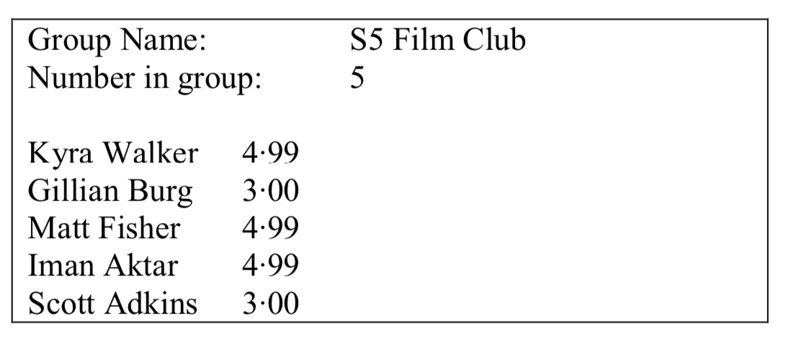
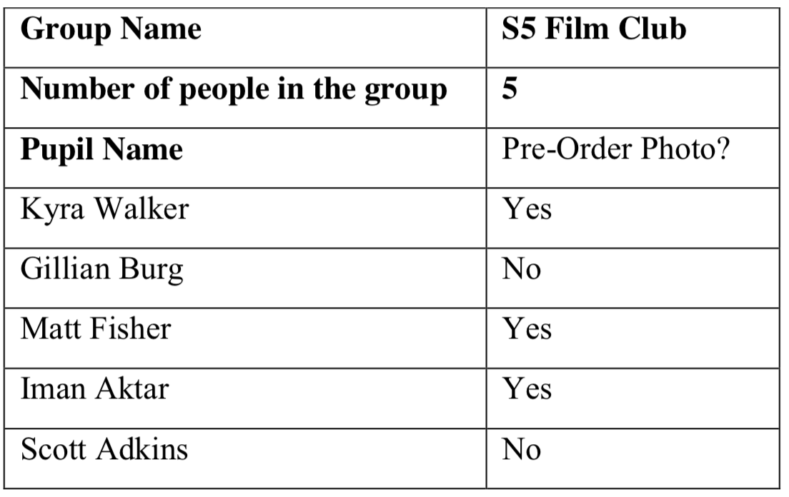

# Dance Ticket Task

Pupils attending the dance must book a table as part of a group. Groups can have a minimum of 4 and a maximum of 10 pupils.

Pupils can buy either an entrance ticket (£3·00) or a ticket that allows entrance and a photo (£4·99).

## Your task

Write a program that will enable the Computing class to calculate the ticket cost for each pupil attending the dance and display individual costs for the group.

### Inputs:

- The name of the group
- A valid number of pupils in the group
- The name of each pupil in the group
- Yes or No to ordering a photo

### Output:

- The name of the group
- The number of pupils in the group
- The name of each pupil in the group
- The total cost of the ticket per pupil (all totals should be displayed to two decimal places).

An example of the output is provided below:

Create and Test this program using Main.java, I have included all the screenshot example programs from class and the dictionary to this task to help.

This task is combining all the individual constructs together (Assignemnt, selection, conditional loop, fixed loop, and arrays)

## Top-Level Algorithm Design

#### MAIN STEPS

1. Get group name
2. Get a valid number of pupils in the group Loop for each pupil in the group
3. Get pupil name
4. Decide and store ticket cost for each pupil End loop
5. Display results

#### REFINEMENTS Step 5

5.1. Decide and store ticket cost for each pupil\
5.2. Ask if pupil wants to pre-order a photo\ 
5.3. If yes then\
5.3. ticket price = 4·99 \
5.4. Else\
5.5. ticket price = 3·00 \
5.6. End If

## Tasks

1. Refine the following parts of the algorithm:
- Get a valid number of pupils in each group (step 2) (**Evidence** design notation refinement of step in the assignement classnotebook)
- Display results (step 7). (**Evidence** design notation refinement of step in the assignement classnotebook)
2. Create a program that matches the refined algorithm. (**evidence** your program code submitted with teh version control)
3. Test your program using the data below:(**evidence** screenshot showing the output from the program added to the assignement classnotebook) 
 
4. Test your program using an exceptional number of people in a group. (**evidence** screenshot of test showing error message added to the assignement classnotebook)
5. Evaluate your program in terms of readability (two points), robustness (one point), and fitness for purpose (one point) (evidence: evaluations written in the assignment class notebook)
